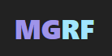

<a name="readme-top"></a>

<div align="center">
  
  <h1 align="center">Meme Generator RF</h1>
  <p align="center">
    A playful meme creation tool made with vanilla web tech. Grab a template, drop in text, export your viral-ready meme.
  </p>
  <p align="center">
    <a href="#about-the-project">About</a> ·
    <a href="#built-with">Built With</a> ·
    <a href="#project-structure">Structure</a> ·
    <a href="#usage">Usage</a>
  </p>
  <p align="center">
    <a href="https://strikeaspect.github.io/Meme-Generator/" target="_blank" rel="noopener noreferrer" style="display: inline-block; padding: 10px 20px; background-color: #202B67; color: white; border-radius: 5px; text-decoration: none; font-weight: bold;">Live Preview</a>
    <a href="https://ko-fi.com/rf_creator" target="_blank" rel="noopener noreferrer" style="display: inline-block; padding: 10px 20px; background-color: #5CE1E6; color: white; border-radius: 5px; text-decoration: none; font-weight: bold; margin-left: 10px;">
      <svg role="img" viewBox="0 0 24 24" xmlns="http://www.w3.org/2000/svg" style="display: inline-block; width: 1em; height: 1em; margin-right: 5px; vertical-align: middle;">
        <title>Ko-fi</title>
        <path fill="currentColor" d="M11.351 2.715c-2.7 0-4.986.025-6.83.26C2.078 3.285 0 5.154 0 8.61c0 3.506.182 6.13 1.585 8.493 1.584 2.701 4.233 4.182 7.662 4.182h.83c4.209 0 6.494-2.234 7.637-4a9.5 9.5 0 0 0 1.091-2.338C21.792 14.688 24 12.22 24 9.208v-.415c0-3.247-2.13-5.507-5.792-5.87-1.558-.156-2.65-.208-6.857-.208m0 1.947c4.208 0 5.09.052 6.571.182 2.624.311 4.13 1.584 4.13 4v.39c0 2.156-1.792 3.844-3.87 3.844h-.935l-.156.649c-.208 1.013-.597 1.818-1.039 2.546-.909 1.428-2.545 3.064-5.922 3.064h-.805c-2.571 0-4.831-.883-6.078-3.195-1.09-2-1.298-4.155-1.298-7.506 0-2.181.857-3.402 3.012-3.714 1.533-.233 3.559-.26 6.39-.26m6.547 2.287c-.416 0-.65.234-.65.546v2.935c0 .311.234.545.65.545 1.324 0 2.051-.754 2.051-2s-.727-2.026-2.052-2.026m-10.39.182c-1.818 0-3.013 1.48-3.013 3.142 0 1.533.858 2.857 1.949 3.897.727.701 1.87 1.429 2.649 1.896a1.47 1.47 0 0 0 1.507 0c.78-.467 1.922-1.195 2.623-1.896 1.117-1.039 1.974-2.364 1.974-3.897 0-1.662-1.247-3.142-3.039-3.142-1.065 0-1.792.545-2.338 1.298-.493-.753-1.246-1.298-2.312-1.298"/>
      </svg>
      Leave a coffee
    </a>
  </p>
</div>

## Built With

* [](https://developer.mozilla.org/en-US/docs/Web/HTML)
* [](https://developer.mozilla.org/en-US/docs/Web/CSS)
* [](https://developer.mozilla.org/en-US/docs/Web/JavaScript)

<p align="right">(<a href="#readme-top">back to top</a>)</p>

## About The Project

This is my lightweight meme generator experience, built as a fun frontend project that turns meme templates into shareable images.

I designed it to be simple and fast:

* fetch meme templates from a public API
* render the gallery instantly in `index.html`
* let users choose a template and edit it in `crea.html`
* paint text onto a canvas and export the final meme

If the API is unavailable, the app gracefully falls back to local placeholder templates so the experience still works.

<p align="right">(<a href="#readme-top">back to top</a>)</p>

## Project Structure

```text
/
├── assets/             # placeholder image assets and visual resources
├── css/
│   ├── main.css        # shared app layout and theme styles
│   └── crea.css        # editor-specific controls and canvas styling
├── scripts/
│   ├── api.js          # meme API loader and fallback handler
│   ├── main.js         # gallery rendering + lazy loading logic
│   ├── canvas.js       # meme canvas editor, text rendering, download export, and project persistence
│   └── ui.js           # template-based UI rendering components
├── crea.html           # meme editor page
├── index.html          # template gallery landing page
├── tests/              # unit tests for core logic and persistence
└── README.md           # this project overview
```

<p align="right">(<a href="#readme-top">back to top</a>)</p>

## Usage

1. Open `index.html` in your browser.
2. Pick a meme template from the gallery.
3. Add top and bottom text in the editor.
4. Adjust the text size slider to fit your message.
5. Hit **"Download Meme"** to save your creation as an image.
6. Use **"Save Project"** to export your work as a JSON file.
7. Use **"Import Project"** to load a previously saved JSON file and resume editing.

### Features

* **Template Selection**: Choose from hundreds of meme templates.
* **Text Editing**: Add top and bottom text with free dragging on the canvas.
* **Persistence**:
    * **Save Project**: Export current state (text, positions, image) as a JSON file.
    * **Import Project**: Load a JSON file to restore the meme state perfectly.
* **UI Templating**: Decoupled DOM logic using `scripts/ui.js` for cleaner rendering.

### Technical Notes

* `scripts/api.js` loads templates from `https://meme-api.com/gimme/15`
* `scripts/main.js` builds the gallery and lazy-loads each image using `ui.js`
* `scripts/canvas.js` handles the canvas rendering and JSON export/import
* `scripts/ui.js` contains the HTML templates for gallery items and controls
* The app works as a static frontend and is best served locally or via a simple static server

<p align="right">(<a href="#readme-top">back to top</a>)</p>

## Contact

[@rf_creator](https://github.com/StrikeAspect)

<p align="right">(<a href="#readme-top">back to top</a>)</p>
